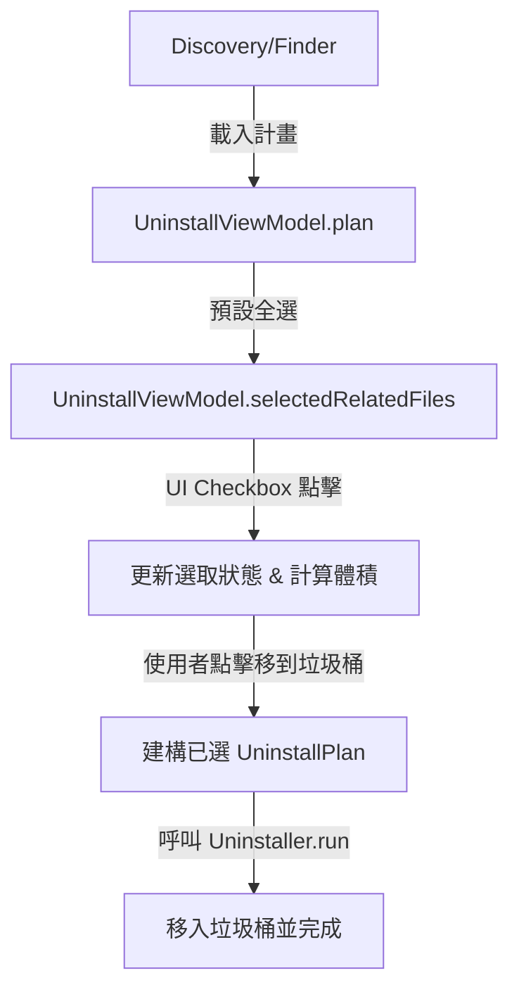

# 設計規格書：優化刪除與清理 UI 介面設計

本規格書規劃了 Glance App 中「清理 (Cleanup)」與「解除安裝 (Uninstall)」兩個主要刪除介面的優化方案。以「現代質感工具風格 (Premium Utility Style)」為導向，並遵循無 Emoji 規則，採用 macOS 原生控制項與 SF Symbols。

## 1. 核心優化目標

- **真實應用程式圖示 (Actual App Icons)**：在解除安裝列表中載入每個 App 的真實 macOS 圖示，取代原本的預設虛線圖示。
- **關聯檔案「個別勾選」**：允許使用者自由勾選/取消勾選要移除的關聯檔案，提高靈活性與安全性。
- **現代卡片化設計 (Bento Grid Style)**：將清理項目的單調列表改為現代卡片外觀，並新增 SF Symbols 作為分類指示。
- **流暢的動態回饋**：優化進度顯示與完成時的成功環形圖（空間釋放環形進度條）。

---

## 2. 詳細設計與元件變更

### A. 應用程式圖示載入 (AppIconView)
新增一個輕量級的 SwiftUI 元件 `AppIconView`，在 `UninstallView` 中使用：
- **實作原理**：利用 AppKit 的 `NSWorkspace.shared.icon(forFile: app.bundleURL.path)` 來獲取 `NSImage`，並包裝為 SwiftUI `Image(nsImage:)`。
- **後備機制 (Fallback)**：若路徑無效或無法載入，則顯示內建的 SF Symbol `app.dashed` 作為佔位符。

### B. 解除安裝關聯檔選擇 (Selective Deletion)
- **ViewModel 狀態新增**：
  - `selectedRelatedFiles: Set<RelatedFile>`：記錄使用者已勾選的關聯檔案。
  - 衍生的屬性：`selectedTotalBytes: UInt64`（計算 App 本體大小 + 已勾選關聯檔大小）與 `selectedItemCount`。
- **UI 變更**：
  - 在關聯檔案列表的每一列前置一個 `Image(systemName: isSelected ? "checkmark.circle.fill" : "circle")`（或原生 `Toggle`）作為核取方塊。
  - 本體列（App Bundle 本身）固定為勾選狀態且不可取消（以維持解除安裝的基本邏輯）。
- **流程整合**：
  - 使用者點擊「移到垃圾桶」時，彈出的確認視窗與最終傳入 `Uninstaller.run(plan:)` 的 `UninstallPlan` 將僅包含「本體」與「已選定的關聯檔案」。

### C. 清理卡片化 (Cleanup Cards)
- **UI 變更**：
  - 將 `CleanupView` 中的原生 `List` 替換為以卡片為單位的 `VStack` 或自訂列。
  - 卡片具備滑鼠懸停 (hover) 的背景色與邊框變化，提升互動感。
  - 為三個預設類別新增對應的 SF Symbols：
    - 垃圾桶 (`.trash`)：`trash`
    - 使用者快取與日誌 (`.userCaches`)：`folder.badge.gearshape`
    - 開發工具快取 (`.devCaches`)：`terminal`

---

## 3. 系統架構與資料流 (Data Flow)

### 3.1 解除安裝關聯檔選擇資料流


### 3.2 關鍵程式碼結構變更

#### `UninstallViewModel`
```swift
// 新增選取狀態
@Published public var selectedRelatedFiles: Set<RelatedFile> = []

// 衍生屬性
public var selectedTotalBytes: UInt64 {
    guard let plan = plan else { return 0 }
    return plan.app.sizeBytes + selectedRelatedFiles.reduce(0) { $0 + $1.sizeBytes }
}

public var selectedItemCount: Int {
    1 + selectedRelatedFiles.count
}
```

---

## 4. 錯誤處理與安全邊界 (Edge Cases)

1. **App 於預覽後被重新啟動**：
   - 繼續維持原有機制：在最終點擊「移到垃圾桶」前，ViewModel 會透過 `isRunning(bundleID)` 再次確認。若 App 正在運行，則拒絕解除安裝並顯示警告訊息。
2. **無存取權限 (Skipped Paths)**：
   - 刪除失敗時，Uninstaller 會將失敗路徑載入至 `skippedPaths`。在 Done 狀態視窗中，明確列出跳過的項目，讓使用者知悉。

---

## 5. 測試策略 (Testing Strategy)

- **單元測試 (Unit Tests)**：
  - 驗證 `UninstallViewModel` 在載入 Plan 後，預設會將所有 `relatedFiles` 存入 `selectedRelatedFiles`。
  - 測試 `toggle` 關聯檔功能：選取狀態、已選體積與計數是否同步正確計算。
  - 測試 `confirmUninstall()` 建立的篩選後 `UninstallPlan` 是否只包含勾選的檔案。
- **手動測試 (Manual Verification)**：
  - 驗證 App Icon 是否能正確顯示，在 App 列表中顯示不同第三方應用的真實圖示。
  - 測試取消勾選某個大容量關聯檔，執行解除安裝後，該檔案確實被保留在硬碟中，而其他已勾選的被移至垃圾桶。
